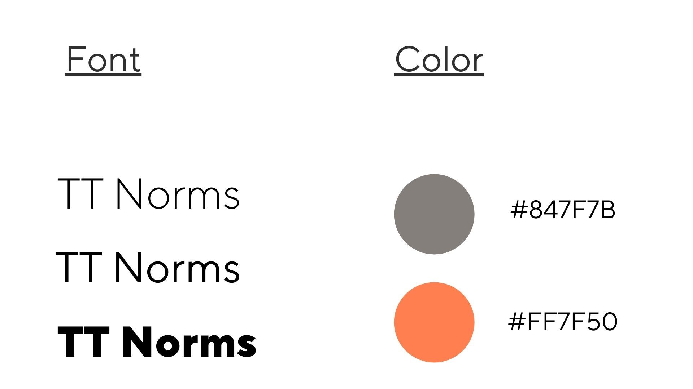

# Peace of Mind

## Description

Are you highly skilled in the art of forgetfulness? I know I am! We're here to offer you some Peace of Mind.

Peace of Mind is a task management app that won't let you forget. Get an indefinite number of alerts via SMS, email, and
voice, so you can't ignore the task at hand.

## Motivation

Time management has gotten tricky since the start of the pandemic. People are experiencing difficulty perceiving the
passage of time, and often feeling "brain fog".

Some tasks are too important to be delayed or forgotten, like taking medications, caring for others, or caring for
yourself.

## Design Elements

## Tech

Peace of Mind was created with an ExpressJS backend and a ReactJS frontend. The data is stored in a hosted Postgres
database.

Interested in contributing? View our [Contribution Guide](CONTRIBUTING.md)!

## Future features

- Indefinite alerts
- Recurring tasks
- Suggest reminders for users to set
  - General
    - Go for a walk
    - Meditate
  - Learning
    - Based on the user's previous reminders
- API is exposed/public so alerts can be created from third party apps like:
  - Trello
  - Jira
  - Google Calendar
  - Google Mail
  - Siri / Alexa
- Symptom tracking
- Mood tracking
  - Possibly alert caregivers or close contacts if mood has been in decline for a long period of time
- Feelings chart with definitions of emotions to help users name their feelings
- Blogging
  - Ability to share blog with caregiver/close contact
- Day planning
  - integrate with google calendar
- Educate users
  - benefits of sleep, exercise, etc.
  - anxiety, depression information
- Provide stats on how quickly users responded to their alerts
- Reward system/gamification for accomplishing tasks
- Create a triggered/crisis button that will immediately alert caregiver/close contact
- Motivational messages on the app
